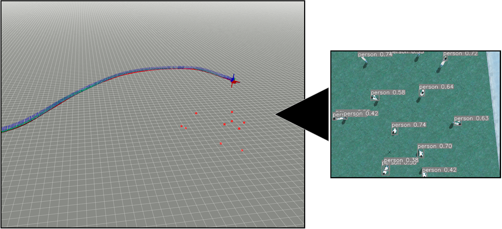

# YOLO Pointcloud

A ROS wrapper for [ultralytics](https://github.com/ultralytics/ultralytics.git) package that produces a Point Cloud based on the detections.

## Subscribing Topics

* <code>/stereo/left/image_raw</code>
* <code>/stereo/left/camera_info</code>
* <code>/stereo/right/image_raw</code>
* <code>/stereo/left/camera_info</code>

## Publishing Topics

* <code>/PointCloud</code>
* <code>/detector/detected_objects</code>
* <code>/detector/detection_image</code>
* <code>/detector_debug</code>

## Parameters

* <code>~weigths</code>\
Path to the network's weights.
* <code>~matching_distance_coefficient</code>\
Distance coefficient of two points, in image pairs, to match them.
* <code>~device</code>\
Device that load the network and handles the detection.
* <code>~camera0_topic</code>
* <code>~camera0_info_topic</code>
* <code>~camera1_topic</code>
* <code>~camera1_info_topic</code>
